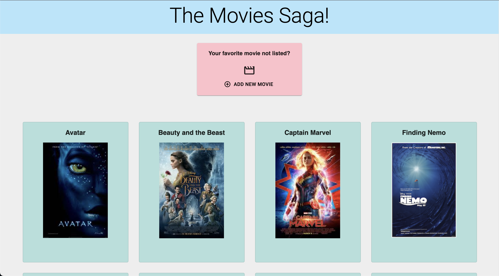
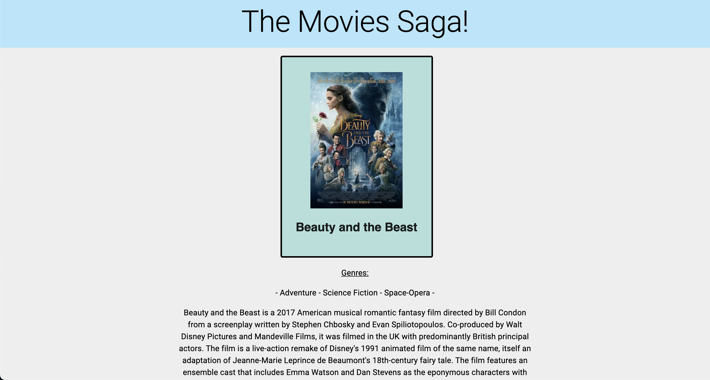
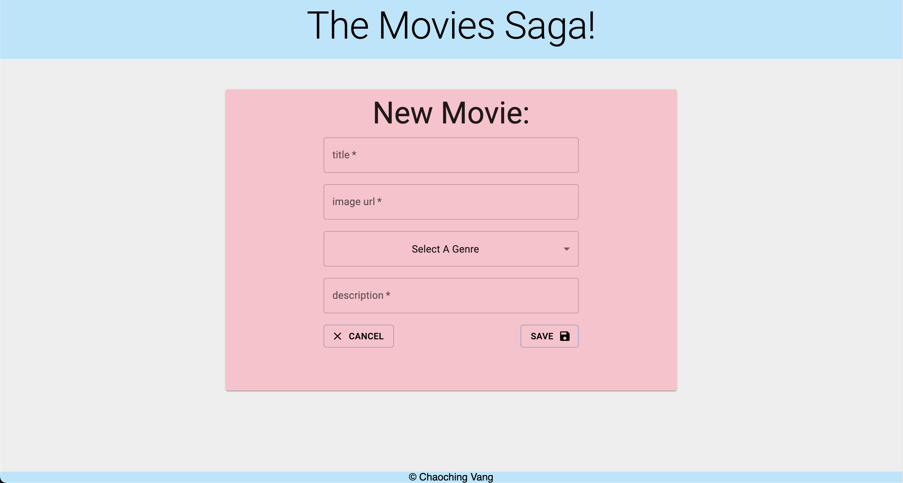

    
    
# Movie Saga List

## Table of Contents

- [Movie Saga List](#movie-saga-list)
  - [Table of Contents](#table-of-contents)
  - [Description](#description)
  - [Screenshots](#screenshots)
  - [Built With](#built-with)
  - [Getting Started](#getting-started)
    - [Prerequisites](#prerequisites)
    - [Installation](#installation)
  - [Usage](#usage)
  - [License](#license)
  - [Acknowledgements](#acknowledgements)
  - [Contacts](#contacts)

## Description

This single page application allows for users to click through the poster of movies to access details of that movie. The user also have the option to add a new movie into the list. This entire app is done with the usage of React, Redux, Saga, and Axios to communicate with the local PostgreSQL database. This application utilizes the CRUD methods to access and send data from the client all the way to the database. The application also utilized Material UI styling. 

## Screenshots

## Built With

## Getting Started

Aside from having the necessary softwares to be able to run the code, no further background information is need to observe and use the functionalities of this project.  

### Prerequisites

Softwares used in creating this project includes:

- Visual Studio Code
- PostgreSQL
- Postico
- Postman

The project will require alterations and possibly additional lines of codes if used with softwares that are not listed above. 

### Installation

To run this project, the user should fork the repository onto their own GitHub repository. In the user's repository, go ahead and copy link and clone onto local system. The project will then be installed using npm by navigating to folder:

- $ cd ../weekend-movie-sagas
- $ npm install

Create a local sql database using PostgreSQL with the provided database.sql file. Using different database systems may require the user to alter or add additional lines of codes in the project to reflect the example database provided. 

To start up the project, simply run the npm command lines of:

- npm run server
- npm run client

## Usage

Once the project is up and running, the user should be redirected to the browser with the project loaded. If not, open up a browser and enter in the url: 
- localhost:3000

On the page the user will see a list of movie posters and titles that was pulled from the database and rendered onto the browser. The user can then click on any movie poster to be redirected to the details page of that particular movie. On this page, the user will see the types of genres and the description of the movie. 

If the user wishes to add another movie onto the list, the user will click the add new movie button to be taken to a new movie form. On this form page, the user will enter in the necessary information such as movie title, poster image url, genre type, and the description of the movie. 

When submitted, the data will be sent over to the local database and the user will then the changes made to the movie list reflected on the browser. The new movie will now have been added onto the list.

## License

<a href="https://choosealicense.com/licenses/unlicense/">The Unlicense</a>

## Acknowledgements

The project was made possible with the help of friends, families and especially with the help of the Solinas Cohort at Prime Digital Academy.

## Contacts

  